# Practica3_II

## Situaciones de aprendizaje

Aqui se muestra un GIF de cada una de las situaciones de aprendizaje que se han realizado en esta práctica.

### Situción 1

En esta situación, el plano y la esfera solo tienen un collider mientras que el cubo tiene un collider y un rigidbody. Al ejecutar la escena, no sucede nada puesto que el cubo, que es el único con físicas, al estar posado en el plano no se mueve.  


### Situción 2

Aqui la situación es similar a la anterior, con la única diferencia de que la esfera ahora tiene un rigidbody. Al ejecutar la escena, la esfera cae sobre el cubo y esta se mueve hacia un lado debido a la colisión.


### Situción 3

Esta situación es casi igual a la anterior pero con la única diferencia de que ahora la esfera es cinemática, por lo tanto al ejecutar la escena el resultado va a ser el mismo que en la situación 1 debido a que la esfera es cinemática.

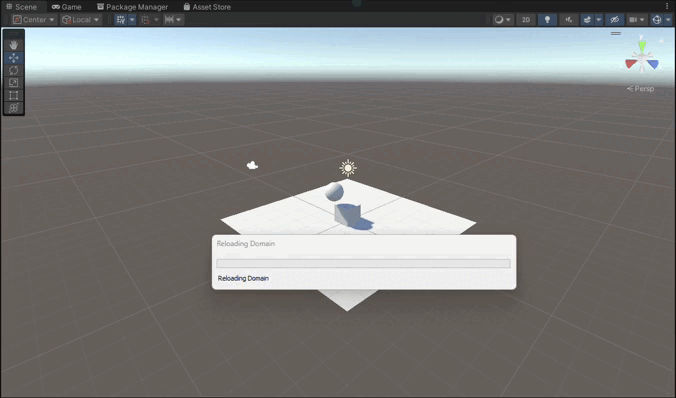

### Situción 4

En esta situación al todos ser objetos físicos, al ejecutar la escena todos los objetos caen.

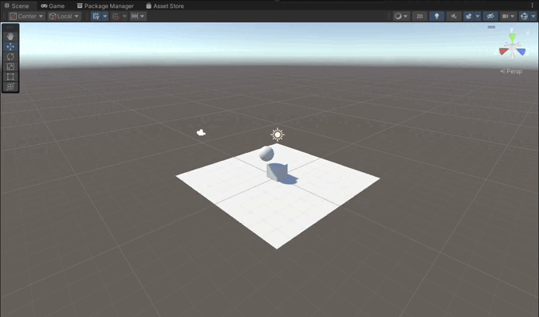

### Situción 5

el resultado de esta situación es el mismo que el anterior, la única diferencia es que ahora la esfera tiene una masa 10 veces mayor que el cubo, pero el resultado sigue siendo el mismo, puesto que, la masa no afecta a la velocidad de caida.

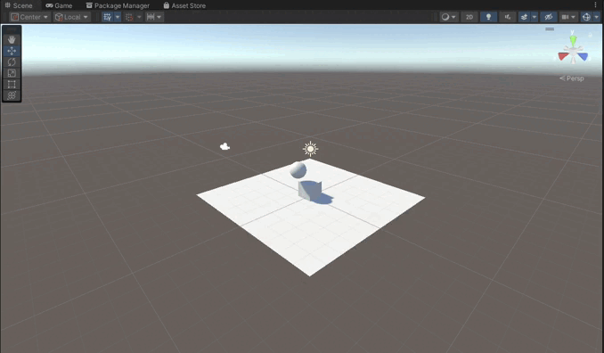

### Situción 6

En esta situación se repite casi lo mismo que en la escena anterior pero ahora la esfera tiene una masa 100 veces mayor que el cubo. 


### Situción 7

En esta situación el resultado es el mismo que en la situación anterior. La única diferencia es que ahora la esfera tiene fricción pero al estar en el aire no afecta en nada.


### Situción 8

En esta situación tenemos que el plano y el cubo son objetos físicos, mientras que la esfera no lo es, pero esta es trigger. Al ejecutar la escena, tanto el plano como el cubo caen, mientras que la esfera no ya que no es un objeto físico, el echo de que sea trigger no afecta en nada.

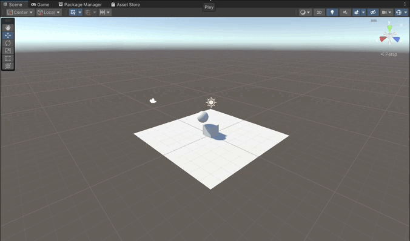

### Situción 9

Esta situación es similar a la anterior, pero ahora la esfera sí es física y mantiene el trigger, el resultado al ejecutar la escena es que todos los objetos caen.

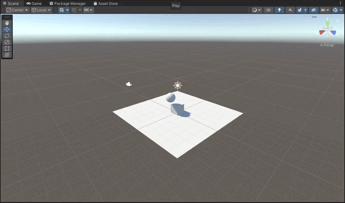

## Ejercicios

Aquí se describen los ejercicios realizados en esta práctica y además se muestra un GIF de su ejecución.

### Ejercicio 1

Para este ejercicio he creado un script donde en el update se comprueba si se ha pulsado alguna de las flechas, en caso de que se haya pulsado la flecha para arriba o para abajo se muestra por consola la multiplicación del eje vertical con una velocidad que se puede cambiar en el inspector, para las flechas izquierda y derecha sería lo mismo pero la velocidad se multiplica por el eje horizontal.


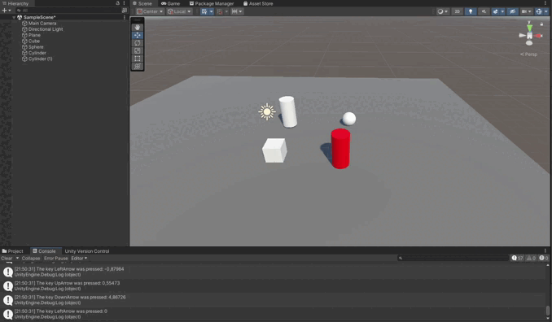

### Ejercicio 2

Para realizar esto se ha accedido a las configuraciones del proyecto y ahi a input manager y se enlaza la tecla "h" a la acción de disparar.

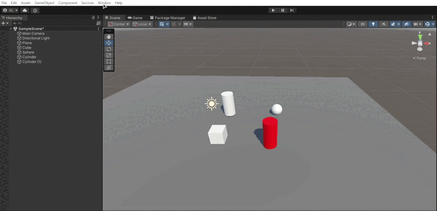

### Ejercicio 3

Para este ejercicio se ha creado un script donde se mueve el cubo a una posición de destino la cual puede ser asignada en el inspector. 

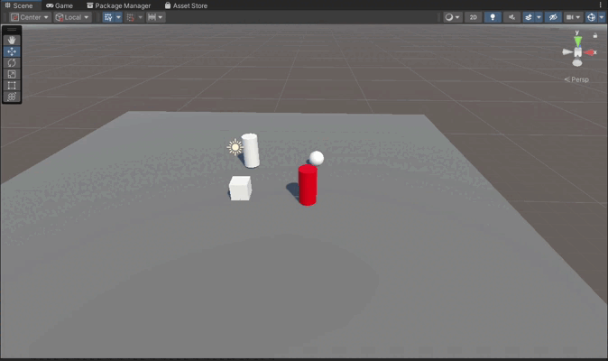

### Ejercicio 4

Para este ejercicio se ha creado un script donde se comprueba en el update si se ha pulsado alguna de las teclas "w", "a", "s" o "d" y en caso de que se haya pulsado se mueve el cubo en la dirección correspondiente con "Vector3.up", "Vector3.left", "Vector3.down", "Vector3.right" respectivamente, además se multiplica por la velocidad, la cual se puede cambiar en el inspector. 

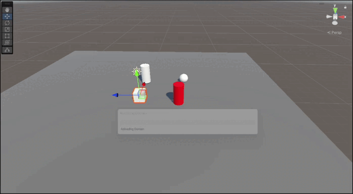

### Ejercicio 5

Para este ejercicio se recicla el script anterior pero ademas de multiplicar por la velocidad se multiplica por "Time.deltatime" para que el movimiento sea proporcional al tiempo que ha pasado desde el último frame.

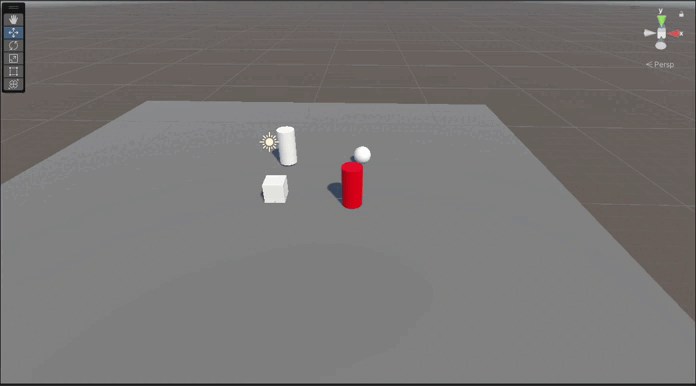

### Ejercicio 6

Para este ejercicio se ha creado un script donde se coge el transform de al esfera y la del cubo, se hace la diferencia entre estas para conocer la dirección en la cual se debe mover el cubo y se mueve el cubo en dicha dirección con el mismo método que en el ejercicio anterior.

### Ejercicio 7

Este ejercicio es muy similar al anterior pero, en este el cubo se mueve hasta la esfera pero, esta última puede cambiar su posición mediante las flechas del teclado. El cubo sigue a la esfera cuando esta se está moviendo.

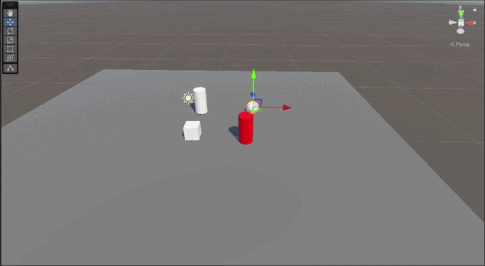

### Ejercicio 8

Para este ejercicio se ha creado un script donde simplemente se mueve el cubo en la dirección "forward" de su transform.

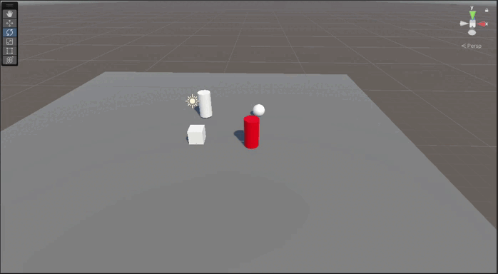

### Ejercicio 9

Para este ejercicio se ha creado un script, el cual es asignado al cilindro que se acaba de introducir, en este se crea una función "void OnCollisionEnter(Collision other)" con la cual se detecta cuando un objeto coliciona con el cilindro, para esto el cilindro ha de tener un componente rigidbody. Cuando detecta que algo ha colisionado con el cilindro, se muestra por consola el nombre del objeto que ha colisionado.

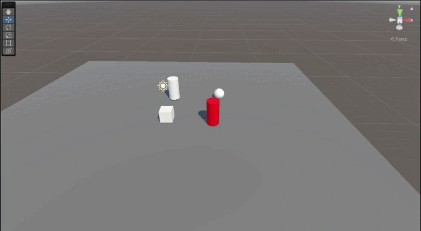

### Ejercicio 10

En este script el resultado es igual que en el ejercicio anterior pero ahora tanto la esfera como el cubo son objetos físicos, este último es cinemático, por lo tanto, el movimiento se sigue realizando de la misma forma, por otro lado, para el movimiento de la esfera se ha tenido que cambiar el script de movimiento, ahora en vez de moverse con el método "transform.Translate()" se mueve con el método "rigidbody.AddForce()" para que la esfera se mueva de forma física.

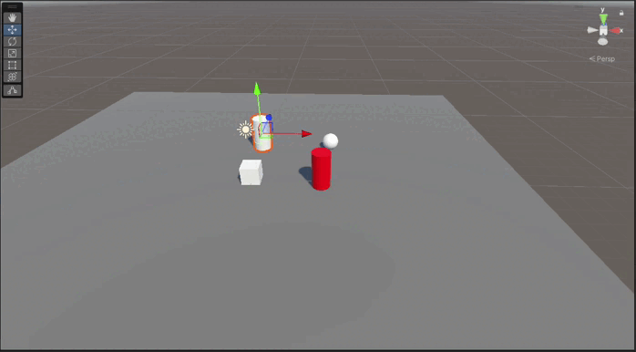

### Ejercicio 11

en este ejercicio se reutilizan tanto el script del cubo como el de la esfera pero se crea uno nuevo para la esfera donde se incluye la funcion "void OnTriggerEnter(Collider other)" puesto que ahora el cilindro es trigger.

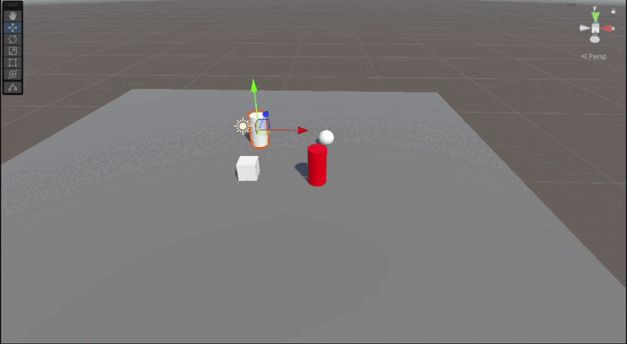

### Ejercicio 12

En este ejercicio se ha añadido otro cilindro (de color rojo), al cual se le ha asignado un script donde se le añade la funcioanlidad de moverse con las teclas "t" (arriba), "g" (abajo), "f" (izquierda) y "h" (derecha). Para realizar el movimiento se hace de la misma forma que en el ejercicio 10 con la esfera. Además, este cilindro sigue a la esfera cuando esta se mueve, para esto se han usado ``` rb.MoveRotation(Quaternion.LookRotation(sphereTransform.position - transform.position)); ``` para rotar el cilindro a la posición de la esfera y ``` rb.MovePosition(transform.position + transform.forward * velocity * Time.deltaTime); ``` para moverlo a hacia la esfera.

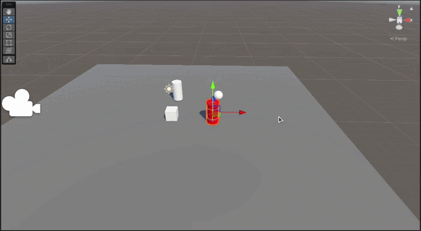
